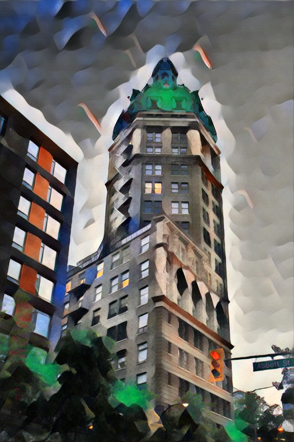
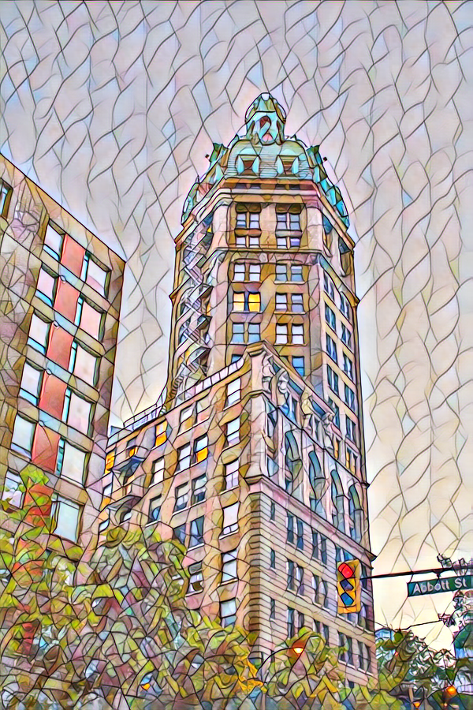
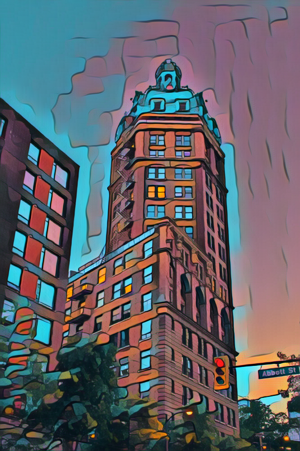

# Style Transfer
This the implementation of style transfer based on the ReCoNet paper [arXiv](https://arxiv.org/abs/1807.01197)

Training scripts were done by me according to multiple papers (see references)

The script train.py trains the network using a single style image for style refrence.  
The script train_multipleStyle.py trains the network using a dataset for both the content images and the style images.  
The script train_temporalLoss.py trains the network with the additional temporal loss function.  

The savedModel folder contains a few saved weights for diffrent style and for diffrent parameter values.

# Datasets
The training for this network was done using a two diffrent dataset.  
[COCO Dataset](http://cocodataset.org/#home)  
[Monkaa Dataset](https://lmb.informatik.uni-freiburg.de/resources/datasets/SceneFlowDatasets.en.html)

# Results
Here are the stylized versions of the following picture according to multiple style references.  
  
  

  
     
   

